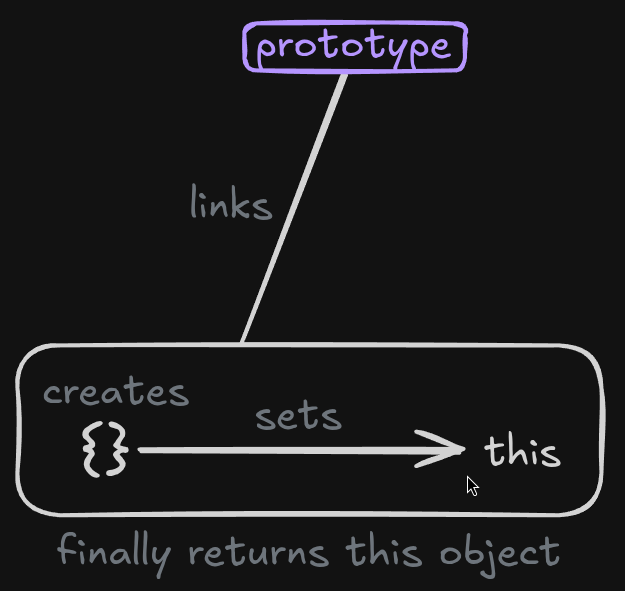

## Explain constructor functions

- A constructor function is a regular JavaScript function used with the new keyword to create objects.
- When a constructor function is called with new, JavaScript performs four steps:
  - **Creates** a new empty object {}.
  - **Sets** this to reference that new object.
  - **Links** the new object to the constructor’s prototype.
  - **Automatically returns** the new object.
    

- Properties defined inside the constructor are created per instance.
- Methods defined on the constructor’s prototype are shared across all instances, making this approach more memory-efficient.
